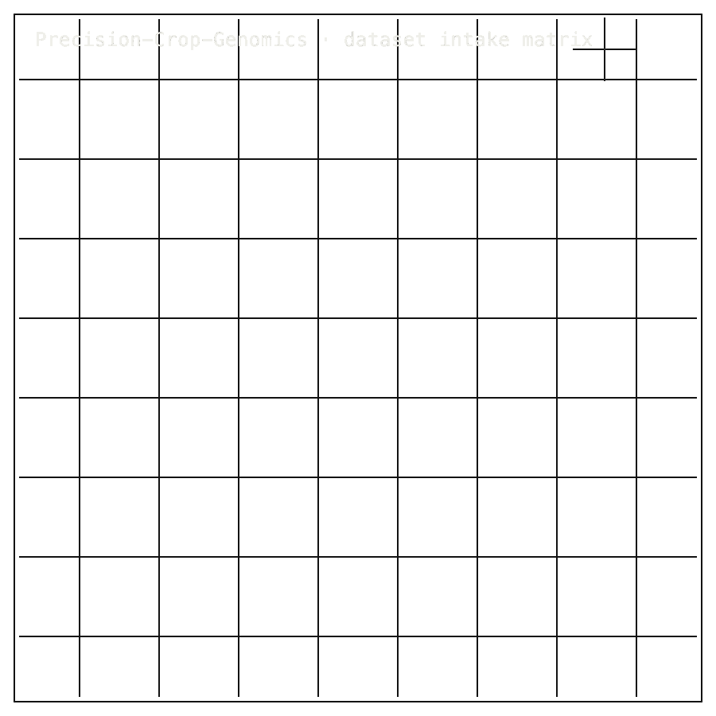

# Precision-Crop-Genomics

## Install / Developer Commands

<!-- INSTALL-DX:START -->
#### Package Boundary

No Phase-0 implementation package, PyPI distribution, or CLI is claimed for this repository. Do not add a fake install surface before implementation exists.
Use the repo-local source, dossier, or proof commands below; do not substitute an unrelated PyPI package.
<!-- INSTALL-DX:END -->

<table width="100%">
<tr>
<td width="100%" valign="top">

<b>00 · PRECISION-CROP-GENOMICS</b> · RESEARCH-INTAKE DOSSIER LIVE LANE · 101000Z

      <h1>No-code crop-genomics research intake dossier.</h1>
      
Precision-Crop-Genomics &middot; research-intake dossier &middot; github.com/Zer0pa/Precision-Crop-Genomics &middot; main

      
A public intake stage for crop-improvement work. <strong>22 named ways this work can fail, 18 things it refuses to do, and 5 public crop datasets</strong> &mdash; G2F maize, CIMMYT wheat, 3KRG rice, TERRA-REF sorghum phenomics, and AgERA5 climate &mdash; are stated in writing before any code lands. The planned deliverable is one Crop Improvement Dossier that carries biology, licensing, breeding routes, and regulatory paths together. <em>No breeding pipeline, gene-edited product, or trait IP exists, and the page does not claim any.</em>

</td>
</tr>
</table>

<table width="100%">
<tr>
<td width="100%" valign="top">
<figure>
        

        <figcaption><b>Scope:</b> intake dossier only. Five public datasets, 22 failure modes, and 18 refusals define the route before any breeding pipeline.</figcaption>
      </figure>
</td>
</tr>
</table>

<table width="100%">
<tr>
<td width="100%" valign="top">

<b>01 · THE GAP</b> MISSING SUBSTRATE

      <h2>&ldquo;Crop programs still pass biology, licensing, and regulatory paths through separate folders.&rdquo;</h2>
</td>
</tr>
</table>

<table width="100%">
<tr>
<td width="100%" valign="top">

<b>02 · MARKETS</b> USD B

      

        

          
Seed technology &rsquo;30  $102.4 B

          
Precision agriculture &rsquo;30  $27.5 B

          
Gene editing in agriculture &rsquo;31  $14.8 B

          
Agricultural genomics &rsquo;30  $9.6 B

          
Crop breeding software &rsquo;30  $3.1 B

        

      

      
Seed and breeding markets are large; the dossier is the intake packet that feeds them, not another product chasing the same dollars.

</td>
</tr>
</table>

<table width="100%">
<tr>
<td width="50%" valign="top">

<b>03 · VALUE OF MARKET</b>

      
$102.4 B

      
Seed technology scales; <b>the intake packet that joins biology, licensing, and regulatory paths in one place still does not exist.</b>

</td>
<td width="50%" valign="top">

<b>04 · INSIGHT</b>

      <h2>A previewed crop dossier &middot; no live pipeline yet.</h2>
</td>
</tr>
</table>

<table width="100%">
<tr>
<td width="50%" valign="top">

<b>05.0 · CURRENT TECH</b> FRAGMENTED HANDOFFS

        
Crop-improvement work today is scattered across genotype databases, breeding simulators, regulatory analysts, and partner-shared PDFs. Licensing arrives late, regulatory routing arrives later, and the breeding team rebuilds the picture every time a project moves to a new partner.

</td>
<td width="50%" valign="top">

<b>05.1 · OUR TECH</b> DOCS-ONLY DISCIPLINE

        
Precision-Crop-Genomics publishes the intake stage in writing first. The planned Crop Improvement Dossier holds <strong>seven sections</strong> &mdash; from IDENTITY through HANDOFF &mdash; alongside <strong>22 named failure modes, 18 things the work refuses to do, and 5 public crop datasets</strong>. Licensing, breeding routes, and regulatory routing sit inside the same packet, so partners read one document instead of stitching four.

</td>
</tr>
</table>

<table width="100%">
<tr>
<td width="100%" valign="top">

<b>05.2 · BENCHMARKS</b> PUBLIC STATUS &middot; 2026-05-14

      

        

          
Risk IDs<b>22</b><small>previewed</small>

          
Sources<b>5</b><small>identified, no runs</small>

          
Dossier<b>7</b><small>planned blocks</small>

          
PRD<b>0/1</b><small>approval pending</small>

        

        

          
Risk IDs previewed  22 IDs

          
Phase-0 implementation  no code

          
Benchmark runs  none

        

      

      
<b>Open work:</b> dossier outline awaits sign-off &middot; Phase-0 code unwritten &middot; benchmark runs not yet attempted.

</td>
</tr>
</table>

<table width="100%">
<tr>
<td width="34%" valign="top">

<b>06 · MEASUREMENT</b> PRE-REGISTRATION SURFACE

      <h2>Twenty-two named risks, eighteen refusals, five public crop datasets.</h2>
</td>
<td width="66%" valign="top">

<b>06.1 · BOUNDED VALIDATION &middot; INTAKE STAGE STATUS</b>

      

        

          
Intake discipline  22 IDs &middot; 18 anti-decisions &middot; public

          
Phase-0 implementation  no code &middot; open

          
Benchmark runs (5 sources)  G2F &middot; CIMMYT &middot; 3KRG &middot; TERRA-REF &middot; AgERA5 &middot; pending

          
PRD operator sign-off  pending

        

      

      
Sources cover maize, wheat, rice, sorghum phenomics, and climate reanalysis. <b>The plan checks the dossier on a laptop before anything runs on a GPU.</b> Implementation, dataset runs, public release, license resolution, and sign-off all remain open.

</td>
</tr>
</table>

<table width="100%">
<tr>
<td width="100%" valign="top">

<b>07 · KEY METRICS</b> PUBLIC STATUS &middot; 2026-05-14

</td>
</tr>
</table>

<table width="100%">
<tr>
<td width="100%" valign="top">

<b>07.1 · RISK IDS</b>

      
22

      
<em>failure_conditions</em> &middot; <b>named in writing before any code</b>

</td>
</tr>
</table>

<table width="100%">
<tr>
<td width="100%" valign="top">

<b>07.2 · BENCHMARK SOURCES</b>

      
5

      
<em>benchmark_sources</em> &middot; <b>G2F &middot; CIMMYT &middot; 3KRG &middot; TERRA-REF &middot; AgERA5</b>

</td>
</tr>
</table>

<table width="100%">
<tr>
<td width="100%" valign="top">

<b>07.3 · DOSSIER SCOPE</b>

      
7

      
<em>dossier_blocks</em> &middot; <b>IDENTITY through HANDOFF in one packet</b>

</td>
</tr>
</table>

<table width="100%">
<tr>
<td width="100%" valign="top">

<b>07.4 · ANTI-DECISIONS</b>

      
18

      
<em>anti_decisions</em> &middot; <b>things the program refuses to do</b>

</td>
</tr>
</table>

<table width="100%">
<tr>
<td width="100%" valign="top">

<b>07.5 · PRD OUTLINE</b>

      
0/1

      
<em>operator_signed_dossier</em> &middot; <b>approval pending</b>

</td>
</tr>
</table>

<table width="100%">
<tr>
<td width="100%" valign="top">

<b>08 · DETERMINISM</b> PRE-REGISTRATION DISCIPLINE

      <h2>What this system refuses to do is fixed before what it does.</h2>
</td>
</tr>
</table>

<table width="100%">
<tr>
<td width="66%" valign="top">

<b>08.1 · WHAT DETERMINISTIC MEANS</b> CONSTRAINTS DECLARED FIRST

      
Determinism here means <em>constraint discipline</em>. <strong>22 failure conditions and 18 anti-decisions</strong> are public before implementation, so Phase-0 work has to encode them before benchmark pressure, partner pressure, or compute-cost pressure can quietly widen the scope.

      
There are no runtime outputs yet. The current state is posture-level: refusal conditions, CPU-first sequencing, and license-routing intentions are committed in public before any code lands. Reproducible artifacts can only be presented after Phase-0 produces them.

</td>
<td width="34%" valign="top">

<b>08.2 · THE FIDELITY GAP</b>

      Honest Blocker &middot;
      
<strong>No Phase-0 implementation exists.</strong> No package, CLI, PyPI release, benchmark run, regulatory filing, or wet-lab output exists. The dossier outline awaits operator approval; license posture is unresolved across public notices. The license-stamping ETL and the CPU-vs-GPU invariance check remain <em>UNTESTED</em>.

</td>
</tr>
</table>

<table width="100%">
<tr>
<td width="33%" valign="top">

<b>09</b> 

      <h2>ONE PACKET FOR THE WHOLE CROP PIPELINE.</h2>
</td>
<td width="67%" valign="top">

<b>09.1 · THIS REPO'S AMBITION</b>

      
Crop-improvement work should travel as one typed packet, not as five separate folders. The ambition is a dossier that carries biology evidence, license class, breeding routes, and regulatory routing together &mdash; so seed companies, breeders, and authorities meet around the same object from the first conversation.

</td>
</tr>
</table>

<table width="100%">
<tr>
<td width="33%" valign="top">

<b>09.2 · WHAT WORKS NOW</b>

        <h2>Working now: the dossier shape, the source list, the refusal conditions, and the routing map sit in public.</h2>
</td>
<td width="67%" valign="top">

<b>09.3 · WHAT'S STILL OPEN</b>

        <h2>Still open: Phase-0 code, license-stamping ETL, benchmark runs, the public license conflict, and partner validation.</h2>
</td>
</tr>
</table>

<table width="100%">
<tr>
<td width="100%" valign="top">

<b>09.4</b> &middot; PARTNER INTAKE &middot; NEAR-TERM (12&ndash;24 MO)

      
Breeding programs receive shaped intake packets

A crop-breeding lead at a seed company or public-sector breeder who receives a typed dossier instead of a slide deck can spend the first meeting picking targets rather than reconstructing what the upstream team meant to propose.

</td>
</tr>
</table>

<table width="100%">
<tr>
<td width="100%" valign="top">

<b>09.5</b> &middot; LICENSING &middot; NEAR-TERM (12&ndash;24 MO)

      
Seed-IP teams price rights from day one

When license class travels inside the dossier instead of being patched in at handoff, a seed-licensing office can flag royalty stacks and freedom-to-operate gaps before a breeding plan is built, not after a field trial has committed staff and seasons.

</td>
</tr>
</table>

<table width="100%">
<tr>
<td width="100%" valign="top">

<b>09.6</b> &middot; REGULATORY ROUTING &middot; MID-TERM (24&ndash;48 MO)

      
Compliance enters before the first cross

A regulatory affairs lead at an agri-biotech company can see GMO, gene-editing, and conventional-breeding pathways routed inside the same packet. The conversation with USDA-APHIS, EFSA, or a national authority starts months earlier and on cleaner terms.

</td>
</tr>
</table>

<table width="100%">
<tr>
<td width="100%" valign="top">

<b>09.7</b> &middot; BREEDING METHOD CHOICE &middot; MID-TERM (24&ndash;48 MO)

      
Cross, MAS, and edit routes stay comparable

A plant-breeding scientist weighing conventional crossing, marker-assisted selection, and CRISPR edits can see all three modalities held in one frame. Trade-offs between speed, license cost, and regulatory burden become visible at planning time, not after method lock-in.

</td>
</tr>
</table>

<table width="100%">
<tr>
<td width="100%" valign="top">

<b>09.8</b> &middot; INDUSTRY EXCHANGE &middot; PARADIGM (48 MO+)

      
Crop partnerships travel as typed packets

If evidence, licensing, and routing converge into one inspectable object, seed companies, public breeding networks, and authorities can swap dossiers the way software teams swap pull requests. The packet, not the slide deck, becomes the unit of crop-improvement collaboration.

</td>
</tr>
</table>
